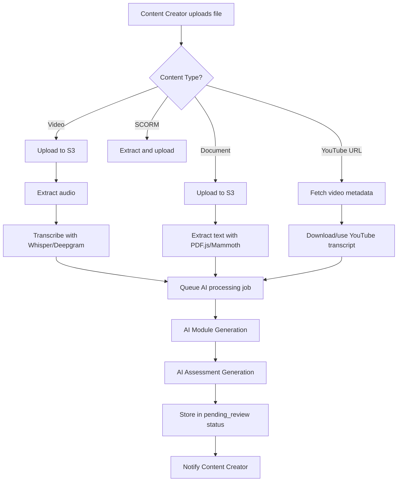

# Business L&D Platform - Comprehensive Design Document

**Date**: 2026-01-28
**Status**: Design Phase
**Target**: Enterprise Learning & Development Platform

---

## Table of Contents

1. [Executive Summary](#executive-summary)
2. [Core Requirements](#core-requirements)
3. [Architecture Overview](#architecture-overview)
4. [Database Schema](#database-schema)
5. [Component Structure](#component-structure)
6. [AI Content Generation Workflow](#ai-content-generation-workflow)
7. [Authentication & Authorization](#authentication--authorization)
8. [API Design](#api-design)
9. [Feature Specifications](#feature-specifications)
10. [Implementation Phases](#implementation-phases)

---

## Executive Summary

Building a comprehensive Business L&D platform that operates **completely separately** from the existing D2C ThoughtMap application. The platform enables organizations to:

- Upload training content (videos, documents) to S3
- AI automatically generates structured learning modules and assessments
- Content Creators review and refine AI-generated content
- Admins approve and assign courses to employees
- Learners take courses, complete assessments, earn certificates
- Track progress, compliance, and skills development across the organization

**Key Differentiators**:
- Complete isolation from D2C codebase
- AI-powered content generation from raw materials
- Enterprise-grade compliance and reporting
- Flat-rate unlimited subscription model
- SSO/SAML authentication
- White-label branding per organization

---

## Core Requirements

### Business Model

**Pricing**: Flat-rate unlimited subscription ($999-2,499/month per organization)
- Unlimited employees
- Unlimited courses
- Unlimited usage
- All features included

**Account Model**: Organization accounts (not personal)
- One organization per account (no multi-org)
- Separate from D2C personal accounts
- Work email domain verification + SSO

### Three Core Roles

1. **Admin**
   - Manages organization settings
   - Assigns courses to employees
   - Views all analytics and reports
   - Manages subscriptions and billing
   - Approves Content Creator's work
   - Bulk operations (import users, batch assignments)

2. **Content Creator**
   - Uploads training materials (videos, documents)
   - Reviews AI-generated modules and assessments
   - Edits and refines content
   - Can manually create courses without AI
   - Submits content to Admin for approval
   - Manages course templates

3. **Learner**
   - Takes assigned courses
   - Views original materials or AI learning paths
   - Completes assessments
   - Earns certificates and badges
   - Tracks own progress
   - Provides course feedback

### Primary Use Cases

1. **Employee Onboarding & Training**
   - Structured learning paths for new hires
   - Product knowledge training
   - Compliance courses (GDPR, Security, etc.)
   - Admin tracks completion and assigns to new employees

2. **Skills Development Programs**
   - Continuous learning for upskilling
   - Personal learning journeys
   - Manager visibility into team progress
   - Skills gap analysis and competency tracking

---

## Architecture Overview

### Complete Isolation Strategy

```
ThoughtMap (D2C)                    Business L&D Platform
├── app/(auth)                      ├── app/(business)
├── app/(dashboard)                 │   ├── page.tsx (business landing)
├── components/chat                 │   ├── login/
├── components/map                  │   ├── signup/
├── components/trail                │   └── org/[orgId]/
├── lib/supabase                    ├── components/business/
├── lib/queries.ts                  │   ├── learning-path/
├── types/index.ts                  │   ├── session/
└── public schema (DB)              │   ├── analytics/
                                    │   └── admin/
                                    ├── lib/business/
                                    │   ├── supabase/
                                    │   ├── queries.ts
                                    │   ├── subscriptions.ts
                                    │   ├── permissions.ts
                                    │   └── analytics.ts
                                    ├── types/business.ts
                                    └── organizations schema (DB)
```

**Key Principles**:
- Zero shared components between D2C and Business
- Separate database schemas (`public` vs `organizations`)
- Different route groups (`(dashboard)` vs `(business)`)
- Isolated utility libraries
- Different terminology throughout

### Terminology Mapping

| D2C Term | Business L&D Term |
|----------|-------------------|
| Expeditions | Learning Paths |
| Trails | Sessions |
| Messages | Interactions |
| Flags | Bookmarks |
| Journal | Progress Report |
| Map View | Learning Journey Map |

### Technology Stack

**Existing (Reused)**:
- Next.js 14 (App Router)
- TypeScript
- Tailwind CSS + shadcn/ui
- Supabase (Database & Auth)
- Vercel AI SDK
- OpenRouter (AI models)

**New (Business-Specific)**:
- AWS S3 (content storage)
- FFmpeg / Transcription service (video processing)
- PDF parsing libraries (document processing)
- SAML/SSO providers (Auth0, Okta, Azure AD)
- Async job queue (for AI processing)
- Full-text search (PostgreSQL or Elasticsearch)

---

## Database Schema

### Schema Organization

All Business L&D tables in **`organizations`** schema (separate from `public` schema used by D2C).

### Complete Schema Definition

```sql
-- Create organizations schema
CREATE SCHEMA IF NOT EXISTS organizations;

------------------------------------------------------------------
-- 1. ORGANIZATION MANAGEMENT
------------------------------------------------------------------

CREATE TABLE organizations.organizations (
  id UUID PRIMARY KEY DEFAULT gen_random_uuid(),
  name TEXT NOT NULL,
  domain TEXT UNIQUE NOT NULL,              -- e.g., 'acmecorp.com'
  slug TEXT UNIQUE NOT NULL,                -- e.g., 'acme-corp'

  -- Branding (white-label)
  logo_url TEXT,
  primary_color TEXT DEFAULT '#3B82F6',
  secondary_color TEXT DEFAULT '#10B981',
  custom_domain TEXT,                       -- e.g., 'learn.acme.com'

  -- Subscription
  subscription_plan TEXT DEFAULT 'enterprise',
  monthly_rate DECIMAL(10,2) NOT NULL,
  billing_email TEXT,
  subscription_status TEXT DEFAULT 'active', -- 'active', 'past_due', 'suspended', 'cancelled'
  subscription_start_date DATE,
  subscription_end_date DATE,

  -- Limits (NULL = unlimited)
  max_users INTEGER,
  max_storage_gb INTEGER,

  -- Settings
  settings JSONB DEFAULT '{
    "sso_enabled": false,
    "sso_provider": null,
    "default_course_passing_score": 80,
    "allow_learner_self_enroll": false,
    "recertification_reminder_days": 30,
    "session_timeout_minutes": 60
  }'::jsonb,

  -- Status
  status TEXT DEFAULT 'active',             -- 'active', 'suspended', 'trial'

  -- Timestamps
  created_at TIMESTAMPTZ DEFAULT NOW(),
  updated_at TIMESTAMPTZ DEFAULT NOW()
);

CREATE INDEX idx_org_domain ON organizations.organizations(domain);
CREATE INDEX idx_org_slug ON organizations.organizations(slug);
CREATE INDEX idx_org_status ON organizations.organizations(status);

------------------------------------------------------------------
-- 2. MEMBERS (EMPLOYEES)
------------------------------------------------------------------

CREATE TABLE organizations.members (
  id UUID PRIMARY KEY DEFAULT gen_random_uuid(),
  org_id UUID NOT NULL REFERENCES organizations.organizations(id) ON DELETE CASCADE,
  user_id UUID NOT NULL REFERENCES auth.users(id) ON DELETE CASCADE,

  -- Profile
  email TEXT NOT NULL,
  full_name TEXT,
  avatar_url TEXT,

  -- Role & permissions
  role TEXT NOT NULL CHECK (role IN ('admin', 'content_creator', 'learner')),

  -- Organizational structure
  department TEXT,
  job_title TEXT,
  manager_id UUID REFERENCES organizations.members(id),
  employee_id TEXT,                         -- External employee ID (from HRIS)

  -- Status
  status TEXT DEFAULT 'active',             -- 'active', 'invited', 'suspended', 'deactivated'

  -- Invitation
  invited_by UUID REFERENCES organizations.members(id),
  invited_at TIMESTAMPTZ DEFAULT NOW(),
  joined_at TIMESTAMPTZ,

  -- Metadata
  metadata JSONB DEFAULT '{}'::jsonb,

  -- Timestamps
  last_login_at TIMESTAMPTZ,
  created_at TIMESTAMPTZ DEFAULT NOW(),
  updated_at TIMESTAMPTZ DEFAULT NOW(),

  UNIQUE(org_id, user_id),
  UNIQUE(org_id, email)
);

CREATE INDEX idx_member_org ON organizations.members(org_id);
CREATE INDEX idx_member_user ON organizations.members(user_id);
CREATE INDEX idx_member_role ON organizations.members(org_id, role);
CREATE INDEX idx_member_status ON organizations.members(status);
CREATE INDEX idx_member_department ON organizations.members(org_id, department);
CREATE INDEX idx_member_manager ON organizations.members(manager_id);

------------------------------------------------------------------
-- 3. SKILLS CATALOG
------------------------------------------------------------------

CREATE TABLE organizations.skills (
  id UUID PRIMARY KEY DEFAULT gen_random_uuid(),
  org_id UUID NOT NULL REFERENCES organizations.organizations(id) ON DELETE CASCADE,

  name TEXT NOT NULL,
  description TEXT,
  category TEXT,                            -- 'technical', 'soft_skills', 'compliance', 'leadership'

  created_at TIMESTAMPTZ DEFAULT NOW(),
  updated_at TIMESTAMPTZ DEFAULT NOW(),

  UNIQUE(org_id, name)
);

CREATE INDEX idx_skill_org ON organizations.skills(org_id);
CREATE INDEX idx_skill_category ON organizations.skills(category);

------------------------------------------------------------------
-- 4. LEARNING PATHS (MULTI-COURSE SEQUENCES)
------------------------------------------------------------------

CREATE TABLE organizations.learning_paths (
  id UUID PRIMARY KEY DEFAULT gen_random_uuid(),
  org_id UUID NOT NULL REFERENCES organizations.organizations(id) ON DELETE CASCADE,

  title TEXT NOT NULL,
  description TEXT,
  thumbnail_url TEXT,

  -- Path type
  type TEXT DEFAULT 'custom',               -- 'onboarding', 'skills_dev', 'compliance', 'custom'

  -- Settings
  is_required BOOLEAN DEFAULT false,
  estimated_duration_hours INTEGER,

  -- Ownership
  created_by UUID REFERENCES organizations.members(id),

  -- Status
  status TEXT DEFAULT 'draft',              -- 'draft', 'published', 'archived'
  published_at TIMESTAMPTZ,

  created_at TIMESTAMPTZ DEFAULT NOW(),
  updated_at TIMESTAMPTZ DEFAULT NOW()
);

CREATE INDEX idx_learning_path_org ON organizations.learning_paths(org_id);
CREATE INDEX idx_learning_path_status ON organizations.learning_paths(status);

------------------------------------------------------------------
-- 5. COURSES
------------------------------------------------------------------

CREATE TABLE organizations.courses (
  id UUID PRIMARY KEY DEFAULT gen_random_uuid(),
  org_id UUID NOT NULL REFERENCES organizations.organizations(id) ON DELETE CASCADE,
  learning_path_id UUID REFERENCES organizations.learning_paths(id) ON DELETE SET NULL,

  -- Basic info
  title TEXT NOT NULL,
  description TEXT,
  thumbnail_url TEXT,

  -- Content type & source
  content_type TEXT NOT NULL,               -- 'video', 'document', 'youtube', 'scorm', 'manual'
  creation_method TEXT NOT NULL DEFAULT 'ai_generated', -- 'ai_generated', 'manual', 'hybrid'

  -- Original content (uploaded files)
  s3_bucket TEXT,
  s3_key TEXT,
  original_file_url TEXT,
  original_file_name TEXT,
  file_size_bytes BIGINT,
  content_metadata JSONB DEFAULT '{}'::jsonb, -- duration, pages, etc.

  -- For external content
  external_url TEXT,                        -- YouTube, Vimeo, etc.

  -- AI generation status
  generation_status TEXT DEFAULT 'pending', -- 'pending', 'processing', 'completed', 'failed'
  generation_error TEXT,
  ai_processing_started_at TIMESTAMPTZ,
  ai_processing_completed_at TIMESTAMPTZ,
  ai_model_used TEXT,

  -- Course settings
  is_mandatory BOOLEAN DEFAULT false,
  is_template BOOLEAN DEFAULT false,
  passing_score_percentage INTEGER DEFAULT 80,
  allow_retakes BOOLEAN DEFAULT true,
  max_retake_attempts INTEGER,              -- NULL = unlimited
  estimated_duration_minutes INTEGER,

  -- Recertification
  requires_recertification BOOLEAN DEFAULT false,
  recertification_interval_months INTEGER,  -- e.g., 12 for annual

  -- Workflow & approvals
  created_by UUID REFERENCES organizations.members(id),
  reviewed_by UUID REFERENCES organizations.members(id), -- content_creator review
  approved_by UUID REFERENCES organizations.members(id), -- admin approval
  reviewed_at TIMESTAMPTZ,
  approved_at TIMESTAMPTZ,

  -- Status
  status TEXT DEFAULT 'draft',              -- 'draft', 'under_review', 'approved', 'published', 'archived'
  published_at TIMESTAMPTZ,

  -- Version control
  version INTEGER DEFAULT 1,
  parent_version_id UUID REFERENCES organizations.courses(id),
  version_notes TEXT,

  -- Order in learning path
  path_order_index INTEGER,

  -- Search
  search_vector tsvector,

  created_at TIMESTAMPTZ DEFAULT NOW(),
  updated_at TIMESTAMPTZ DEFAULT NOW()
);

CREATE INDEX idx_course_org ON organizations.courses(org_id);
CREATE INDEX idx_course_status ON organizations.courses(status);
CREATE INDEX idx_course_learning_path ON organizations.courses(learning_path_id);
CREATE INDEX idx_course_mandatory ON organizations.courses(org_id, is_mandatory);
CREATE INDEX idx_course_generation_status ON organizations.courses(generation_status);
CREATE INDEX idx_course_search ON organizations.courses USING gin(search_vector);

------------------------------------------------------------------
-- 6. COURSE SKILLS MAPPING
------------------------------------------------------------------

CREATE TABLE organizations.course_skills (
  course_id UUID NOT NULL REFERENCES organizations.courses(id) ON DELETE CASCADE,
  skill_id UUID NOT NULL REFERENCES organizations.skills(id) ON DELETE CASCADE,
  proficiency_level TEXT,                   -- 'beginner', 'intermediate', 'advanced'

  PRIMARY KEY (course_id, skill_id)
);

CREATE INDEX idx_course_skills_course ON organizations.course_skills(course_id);
CREATE INDEX idx_course_skills_skill ON organizations.course_skills(skill_id);

------------------------------------------------------------------
-- 7. COURSE PREREQUISITES
------------------------------------------------------------------

CREATE TABLE organizations.course_prerequisites (
  course_id UUID NOT NULL REFERENCES organizations.courses(id) ON DELETE CASCADE,
  prerequisite_course_id UUID NOT NULL REFERENCES organizations.courses(id) ON DELETE CASCADE,
  is_required BOOLEAN DEFAULT true,

  PRIMARY KEY (course_id, prerequisite_course_id),
  CHECK (course_id != prerequisite_course_id)
);

CREATE INDEX idx_prerequisite_course ON organizations.course_prerequisites(course_id);

------------------------------------------------------------------
-- 8. MODULES (AI-GENERATED LEARNING UNITS)
------------------------------------------------------------------

CREATE TABLE organizations.modules (
  id UUID PRIMARY KEY DEFAULT gen_random_uuid(),
  course_id UUID NOT NULL REFERENCES organizations.courses(id) ON DELETE CASCADE,

  title TEXT NOT NULL,
  description TEXT,

  -- Learning content (AI-generated or manual)
  content TEXT NOT NULL,                    -- Markdown formatted
  learning_objectives TEXT[],

  -- Link to original content segment
  video_start_time_seconds INTEGER,
  video_end_time_seconds INTEGER,
  document_page_start INTEGER,
  document_page_end INTEGER,

  -- Module metadata
  order_index INTEGER NOT NULL,
  estimated_duration_minutes INTEGER,

  -- For video modules
  video_thumbnail_url TEXT,
  video_transcript TEXT,
  video_timestamps JSONB,                   -- {"00:30": "Introduction", "02:15": "Key concept"}

  created_at TIMESTAMPTZ DEFAULT NOW(),
  updated_at TIMESTAMPTZ DEFAULT NOW()
);

CREATE INDEX idx_module_course ON organizations.modules(course_id);
CREATE INDEX idx_module_order ON organizations.modules(course_id, order_index);

------------------------------------------------------------------
-- 9. ASSESSMENTS
------------------------------------------------------------------

CREATE TABLE organizations.assessments (
  id UUID PRIMARY KEY DEFAULT gen_random_uuid(),
  course_id UUID NOT NULL REFERENCES organizations.courses(id) ON DELETE CASCADE,
  module_id UUID REFERENCES organizations.modules(id) ON DELETE CASCADE, -- NULL = overall assessment

  title TEXT NOT NULL,
  description TEXT,
  instructions TEXT,

  -- Assessment type
  assessment_type TEXT DEFAULT 'module',    -- 'module', 'overall', 'prerequisite'

  -- Settings
  passing_score_percentage INTEGER DEFAULT 80,
  time_limit_minutes INTEGER,               -- NULL = no limit
  randomize_questions BOOLEAN DEFAULT true,
  questions_to_show INTEGER,                -- NULL = show all
  show_results_immediately BOOLEAN DEFAULT true,
  allow_review_after_submission BOOLEAN DEFAULT true,

  -- Order
  order_index INTEGER,

  created_at TIMESTAMPTZ DEFAULT NOW(),
  updated_at TIMESTAMPTZ DEFAULT NOW()
);

CREATE INDEX idx_assessment_course ON organizations.assessments(course_id);
CREATE INDEX idx_assessment_module ON organizations.assessments(module_id);

------------------------------------------------------------------
-- 10. QUESTIONS (QUESTION POOL)
------------------------------------------------------------------

CREATE TABLE organizations.questions (
  id UUID PRIMARY KEY DEFAULT gen_random_uuid(),
  assessment_id UUID NOT NULL REFERENCES organizations.assessments(id) ON DELETE CASCADE,

  question_text TEXT NOT NULL,
  question_type TEXT DEFAULT 'multiple_choice', -- 'multiple_choice', 'true_false', 'multi_select'

  -- Difficulty & metadata
  difficulty TEXT,                          -- 'easy', 'medium', 'hard'
  explanation TEXT,                         -- Shown after answering
  hint TEXT,

  -- Points
  points INTEGER DEFAULT 1,

  -- Question pool (for randomization)
  pool_tag TEXT,                            -- Group related questions

  order_index INTEGER NOT NULL,

  created_at TIMESTAMPTZ DEFAULT NOW(),
  updated_at TIMESTAMPTZ DEFAULT NOW()
);

CREATE INDEX idx_question_assessment ON organizations.questions(assessment_id);
CREATE INDEX idx_question_pool ON organizations.questions(assessment_id, pool_tag);

------------------------------------------------------------------
-- 11. ANSWER OPTIONS
------------------------------------------------------------------

CREATE TABLE organizations.answer_options (
  id UUID PRIMARY KEY DEFAULT gen_random_uuid(),
  question_id UUID NOT NULL REFERENCES organizations.questions(id) ON DELETE CASCADE,

  option_text TEXT NOT NULL,
  is_correct BOOLEAN DEFAULT false,
  explanation TEXT,                         -- Why this answer is correct/incorrect

  order_index INTEGER NOT NULL,

  created_at TIMESTAMPTZ DEFAULT NOW()
);

CREATE INDEX idx_answer_option_question ON organizations.answer_options(question_id);

------------------------------------------------------------------
-- 12. COURSE ASSIGNMENTS
------------------------------------------------------------------

CREATE TABLE organizations.course_assignments (
  id UUID PRIMARY KEY DEFAULT gen_random_uuid(),
  course_id UUID NOT NULL REFERENCES organizations.courses(id) ON DELETE CASCADE,
  member_id UUID NOT NULL REFERENCES organizations.members(id) ON DELETE CASCADE,

  -- Assignment details
  assigned_by UUID REFERENCES organizations.members(id),
  due_date DATE,
  is_mandatory BOOLEAN DEFAULT false,

  -- Reminders
  reminder_sent_at TIMESTAMPTZ,
  overdue_reminder_sent_at TIMESTAMPTZ,

  assigned_at TIMESTAMPTZ DEFAULT NOW(),

  UNIQUE(course_id, member_id)
);

CREATE INDEX idx_assignment_course ON organizations.course_assignments(course_id);
CREATE INDEX idx_assignment_member ON organizations.course_assignments(member_id);
CREATE INDEX idx_assignment_due_date ON organizations.course_assignments(due_date);
CREATE INDEX idx_assignment_mandatory ON organizations.course_assignments(org_id, is_mandatory)
  WHERE is_mandatory = true;

-- Note: Need to add org_id to course_assignments for the last index
ALTER TABLE organizations.course_assignments
  ADD COLUMN org_id UUID REFERENCES organizations.organizations(id);

------------------------------------------------------------------
-- 13. ENROLLMENTS (LEARNER PROGRESS)
------------------------------------------------------------------

CREATE TABLE organizations.enrollments (
  id UUID PRIMARY KEY DEFAULT gen_random_uuid(),
  course_id UUID NOT NULL REFERENCES organizations.courses(id) ON DELETE CASCADE,
  member_id UUID NOT NULL REFERENCES organizations.members(id) ON DELETE CASCADE,

  -- Progress tracking
  status TEXT DEFAULT 'not_started',        -- 'not_started', 'in_progress', 'completed', 'failed', 'expired'
  progress_percentage INTEGER DEFAULT 0,
  current_module_id UUID REFERENCES organizations.modules(id),

  -- Timestamps
  started_at TIMESTAMPTZ,
  last_accessed_at TIMESTAMPTZ,
  completed_at TIMESTAMPTZ,

  -- Assessment results
  overall_score_percentage DECIMAL(5,2),
  passed BOOLEAN,
  attempts_count INTEGER DEFAULT 0,

  -- Recertification
  expires_at TIMESTAMPTZ,                   -- When course needs recertification
  recertified_from_enrollment_id UUID REFERENCES organizations.enrollments(id),

  -- Course version
  course_version INTEGER DEFAULT 1,

  created_at TIMESTAMPTZ DEFAULT NOW(),
  updated_at TIMESTAMPTZ DEFAULT NOW(),

  UNIQUE(course_id, member_id, course_version)
);

CREATE INDEX idx_enrollment_course ON organizations.enrollments(course_id);
CREATE INDEX idx_enrollment_member ON organizations.enrollments(member_id);
CREATE INDEX idx_enrollment_status ON organizations.enrollments(status);
CREATE INDEX idx_enrollment_expiring ON organizations.enrollments(expires_at)
  WHERE expires_at IS NOT NULL AND status = 'completed';

------------------------------------------------------------------
-- 14. MODULE PROGRESS
------------------------------------------------------------------

CREATE TABLE organizations.module_progress (
  id UUID PRIMARY KEY DEFAULT gen_random_uuid(),
  enrollment_id UUID NOT NULL REFERENCES organizations.enrollments(id) ON DELETE CASCADE,
  module_id UUID NOT NULL REFERENCES organizations.modules(id) ON DELETE CASCADE,

  -- Progress status
  status TEXT DEFAULT 'not_started',        -- 'not_started', 'in_progress', 'completed'

  -- Time tracking
  time_spent_seconds INTEGER DEFAULT 0,

  -- For video content
  video_progress_seconds INTEGER DEFAULT 0,
  video_completed BOOLEAN DEFAULT false,
  last_watch_position_seconds INTEGER DEFAULT 0,

  -- Timestamps
  started_at TIMESTAMPTZ,
  completed_at TIMESTAMPTZ,
  last_accessed_at TIMESTAMPTZ,

  UNIQUE(enrollment_id, module_id)
);

CREATE INDEX idx_module_progress_enrollment ON organizations.module_progress(enrollment_id);
CREATE INDEX idx_module_progress_status ON organizations.module_progress(enrollment_id, status);

------------------------------------------------------------------
-- 15. VIDEO BOOKMARKS & NOTES
------------------------------------------------------------------

CREATE TABLE organizations.video_bookmarks (
  id UUID PRIMARY KEY DEFAULT gen_random_uuid(),
  module_progress_id UUID NOT NULL REFERENCES organizations.module_progress(id) ON DELETE CASCADE,
  member_id UUID NOT NULL REFERENCES organizations.members(id) ON DELETE CASCADE,

  timestamp_seconds INTEGER NOT NULL,
  note TEXT,

  created_at TIMESTAMPTZ DEFAULT NOW(),
  updated_at TIMESTAMPTZ DEFAULT NOW()
);

CREATE INDEX idx_bookmark_progress ON organizations.video_bookmarks(module_progress_id);
CREATE INDEX idx_bookmark_member ON organizations.video_bookmarks(member_id);

------------------------------------------------------------------
-- 16. ASSESSMENT ATTEMPTS
------------------------------------------------------------------

CREATE TABLE organizations.assessment_attempts (
  id UUID PRIMARY KEY DEFAULT gen_random_uuid(),
  enrollment_id UUID NOT NULL REFERENCES organizations.enrollments(id) ON DELETE CASCADE,
  assessment_id UUID NOT NULL REFERENCES organizations.assessments(id) ON DELETE CASCADE,
  member_id UUID NOT NULL REFERENCES organizations.members(id) ON DELETE CASCADE,

  -- Attempt info
  attempt_number INTEGER NOT NULL,

  -- Results
  score_percentage DECIMAL(5,2),
  points_earned INTEGER,
  total_points INTEGER,
  passed BOOLEAN,

  -- Questions selected (from pool)
  questions_selected UUID[],

  -- Timing
  started_at TIMESTAMPTZ DEFAULT NOW(),
  submitted_at TIMESTAMPTZ,
  time_taken_seconds INTEGER,

  -- State
  is_submitted BOOLEAN DEFAULT false,

  UNIQUE(enrollment_id, assessment_id, attempt_number)
);

CREATE INDEX idx_attempt_enrollment ON organizations.assessment_attempts(enrollment_id);
CREATE INDEX idx_attempt_assessment ON organizations.assessment_attempts(assessment_id);
CREATE INDEX idx_attempt_member ON organizations.assessment_attempts(member_id);

------------------------------------------------------------------
-- 17. USER ANSWERS
------------------------------------------------------------------

CREATE TABLE organizations.user_answers (
  id UUID PRIMARY KEY DEFAULT gen_random_uuid(),
  attempt_id UUID NOT NULL REFERENCES organizations.assessment_attempts(id) ON DELETE CASCADE,
  question_id UUID NOT NULL REFERENCES organizations.questions(id) ON DELETE CASCADE,

  -- Answer
  selected_option_ids UUID[],               -- Array for multi-select questions
  is_correct BOOLEAN,
  points_earned INTEGER,

  -- Metadata
  time_taken_seconds INTEGER,
  answered_at TIMESTAMPTZ DEFAULT NOW()
);

CREATE INDEX idx_user_answer_attempt ON organizations.user_answers(attempt_id);
CREATE INDEX idx_user_answer_question ON organizations.user_answers(question_id);

------------------------------------------------------------------
-- 18. CERTIFICATES
------------------------------------------------------------------

CREATE TABLE organizations.certificates (
  id UUID PRIMARY KEY DEFAULT gen_random_uuid(),
  enrollment_id UUID NOT NULL REFERENCES organizations.enrollments(id) ON DELETE CASCADE,
  member_id UUID NOT NULL REFERENCES organizations.members(id) ON DELETE CASCADE,
  course_id UUID NOT NULL REFERENCES organizations.courses(id) ON DELETE CASCADE,
  org_id UUID NOT NULL REFERENCES organizations.organizations(id) ON DELETE CASCADE,

  -- Certificate details
  certificate_number TEXT UNIQUE NOT NULL,
  issued_at TIMESTAMPTZ DEFAULT NOW(),
  expires_at TIMESTAMPTZ,

  -- Performance
  score_percentage DECIMAL(5,2),
  completion_time_hours INTEGER,

  -- File storage
  s3_bucket TEXT,
  s3_key TEXT,
  pdf_url TEXT,

  -- Verification
  verification_hash TEXT UNIQUE NOT NULL,
  is_revoked BOOLEAN DEFAULT false,
  revoked_at TIMESTAMPTZ,
  revoked_by UUID REFERENCES organizations.members(id),
  revocation_reason TEXT
);

CREATE INDEX idx_certificate_member ON organizations.certificates(member_id);
CREATE INDEX idx_certificate_course ON organizations.certificates(course_id);
CREATE INDEX idx_certificate_org ON organizations.certificates(org_id);
CREATE INDEX idx_certificate_verification ON organizations.certificates(verification_hash);
CREATE INDEX idx_certificate_number ON organizations.certificates(certificate_number);

------------------------------------------------------------------
-- 19. MEMBER SKILLS (EARNED FROM COURSES)
------------------------------------------------------------------

CREATE TABLE organizations.member_skills (
  member_id UUID NOT NULL REFERENCES organizations.members(id) ON DELETE CASCADE,
  skill_id UUID NOT NULL REFERENCES organizations.skills(id) ON DELETE CASCADE,

  proficiency_level TEXT,                   -- 'beginner', 'intermediate', 'advanced'

  -- How skill was earned
  earned_from_course_id UUID REFERENCES organizations.courses(id),
  earned_from_enrollment_id UUID REFERENCES organizations.enrollments(id),

  earned_at TIMESTAMPTZ DEFAULT NOW(),
  last_practiced_at TIMESTAMPTZ,

  PRIMARY KEY (member_id, skill_id)
);

CREATE INDEX idx_member_skill_member ON organizations.member_skills(member_id);
CREATE INDEX idx_member_skill_skill ON organizations.member_skills(skill_id);

------------------------------------------------------------------
-- 20. GAMIFICATION - BADGES
------------------------------------------------------------------

CREATE TABLE organizations.badges (
  id UUID PRIMARY KEY DEFAULT gen_random_uuid(),
  org_id UUID NOT NULL REFERENCES organizations.organizations(id) ON DELETE CASCADE,

  name TEXT NOT NULL,
  description TEXT,
  icon_url TEXT,

  -- Criteria
  badge_type TEXT NOT NULL,                 -- 'first_course', 'five_courses', 'perfect_score', 'streak', 'skill_master'
  criteria JSONB NOT NULL,                  -- {"courses_count": 5} or {"streak_days": 7}

  -- Points value
  points INTEGER DEFAULT 10,

  created_at TIMESTAMPTZ DEFAULT NOW(),

  UNIQUE(org_id, badge_type, criteria)
);

CREATE INDEX idx_badge_org ON organizations.badges(org_id);

------------------------------------------------------------------
-- 21. MEMBER BADGES (EARNED)
------------------------------------------------------------------

CREATE TABLE organizations.member_badges (
  id UUID PRIMARY KEY DEFAULT gen_random_uuid(),
  member_id UUID NOT NULL REFERENCES organizations.members(id) ON DELETE CASCADE,
  badge_id UUID NOT NULL REFERENCES organizations.badges(id) ON DELETE CASCADE,

  earned_at TIMESTAMPTZ DEFAULT NOW(),

  UNIQUE(member_id, badge_id)
);

CREATE INDEX idx_member_badge_member ON organizations.member_badges(member_id);

------------------------------------------------------------------
-- 22. GAMIFICATION - POINTS
------------------------------------------------------------------

CREATE TABLE organizations.member_points (
  member_id UUID PRIMARY KEY REFERENCES organizations.members(id) ON DELETE CASCADE,

  total_points INTEGER DEFAULT 0,
  current_streak_days INTEGER DEFAULT 0,
  longest_streak_days INTEGER DEFAULT 0,
  last_activity_date DATE,

  updated_at TIMESTAMPTZ DEFAULT NOW()
);

------------------------------------------------------------------
-- 23. COURSE FEEDBACK & RATINGS
------------------------------------------------------------------

CREATE TABLE organizations.course_feedback (
  id UUID PRIMARY KEY DEFAULT gen_random_uuid(),
  course_id UUID NOT NULL REFERENCES organizations.courses(id) ON DELETE CASCADE,
  member_id UUID NOT NULL REFERENCES organizations.members(id) ON DELETE CASCADE,
  enrollment_id UUID NOT NULL REFERENCES organizations.enrollments(id) ON DELETE CASCADE,

  -- Rating
  rating INTEGER CHECK (rating >= 1 AND rating <= 5),

  -- Feedback
  feedback_text TEXT,
  would_recommend BOOLEAN,

  -- Structured feedback
  content_quality_rating INTEGER CHECK (content_quality_rating >= 1 AND content_quality_rating <= 5),
  difficulty_rating INTEGER CHECK (difficulty_rating >= 1 AND difficulty_rating <= 5),

  -- Visibility
  is_visible BOOLEAN DEFAULT true,

  created_at TIMESTAMPTZ DEFAULT NOW(),
  updated_at TIMESTAMPTZ DEFAULT NOW(),

  UNIQUE(enrollment_id)
);

CREATE INDEX idx_feedback_course ON organizations.course_feedback(course_id);
CREATE INDEX idx_feedback_rating ON organizations.course_feedback(course_id, rating);

------------------------------------------------------------------
-- 24. NOTIFICATIONS
------------------------------------------------------------------

CREATE TABLE organizations.notifications (
  id UUID PRIMARY KEY DEFAULT gen_random_uuid(),
  org_id UUID NOT NULL REFERENCES organizations.organizations(id) ON DELETE CASCADE,
  member_id UUID NOT NULL REFERENCES organizations.members(id) ON DELETE CASCADE,

  -- Notification details
  type TEXT NOT NULL,                       -- 'course_assigned', 'deadline_reminder', 'course_completed', etc.
  title TEXT NOT NULL,
  message TEXT NOT NULL,
  action_url TEXT,

  -- Related entities
  course_id UUID REFERENCES organizations.courses(id) ON DELETE CASCADE,
  enrollment_id UUID REFERENCES organizations.enrollments(id) ON DELETE CASCADE,
  learning_path_id UUID REFERENCES organizations.learning_paths(id) ON DELETE CASCADE,

  -- Priority
  priority TEXT DEFAULT 'normal',           -- 'low', 'normal', 'high', 'urgent'

  -- Delivery status
  read BOOLEAN DEFAULT false,
  read_at TIMESTAMPTZ,

  -- Email delivery
  email_sent BOOLEAN DEFAULT false,
  email_sent_at TIMESTAMPTZ,
  email_delivery_status TEXT,

  created_at TIMESTAMPTZ DEFAULT NOW()
);

CREATE INDEX idx_notification_member ON organizations.notifications(member_id, read);
CREATE INDEX idx_notification_created ON organizations.notifications(created_at DESC);
CREATE INDEX idx_notification_type ON organizations.notifications(type);

------------------------------------------------------------------
-- 25. AUDIT LOG (COMPREHENSIVE COMPLIANCE TRAIL)
------------------------------------------------------------------

CREATE TABLE organizations.audit_log (
  id UUID PRIMARY KEY DEFAULT gen_random_uuid(),
  org_id UUID NOT NULL REFERENCES organizations.organizations(id) ON DELETE CASCADE,

  -- Actor
  actor_member_id UUID REFERENCES organizations.members(id),
  actor_email TEXT,
  actor_role TEXT,

  -- Action
  action TEXT NOT NULL,                     -- 'login', 'view_course', 'submit_assessment', 'assign_course', etc.
  resource_type TEXT,                       -- 'course', 'module', 'assessment', 'member', etc.
  resource_id UUID,

  -- Context
  ip_address INET,
  user_agent TEXT,

  -- Details
  details JSONB DEFAULT '{}'::jsonb,

  -- Timestamp (immutable)
  created_at TIMESTAMPTZ DEFAULT NOW()
);

CREATE INDEX idx_audit_org ON organizations.audit_log(org_id);
CREATE INDEX idx_audit_actor ON organizations.audit_log(actor_member_id);
CREATE INDEX idx_audit_action ON organizations.audit_log(action);
CREATE INDEX idx_audit_resource ON organizations.audit_log(resource_type, resource_id);
CREATE INDEX idx_audit_created ON organizations.audit_log(created_at DESC);

-- Prevent modifications to audit log
CREATE RULE audit_log_no_update AS ON UPDATE TO organizations.audit_log DO INSTEAD NOTHING;
CREATE RULE audit_log_no_delete AS ON DELETE TO organizations.audit_log DO INSTEAD NOTHING;

------------------------------------------------------------------
-- 26. SCHEDULED JOBS (FOR REMINDERS, RECERTIFICATIONS)
------------------------------------------------------------------

CREATE TABLE organizations.scheduled_assignments (
  id UUID PRIMARY KEY DEFAULT gen_random_uuid(),
  org_id UUID NOT NULL REFERENCES organizations.organizations(id) ON DELETE CASCADE,
  course_id UUID NOT NULL REFERENCES organizations.courses(id) ON DELETE CASCADE,

  -- Scheduling
  schedule_type TEXT NOT NULL,              -- 'one_time', 'on_hire_date', 'recurring'
  scheduled_date DATE,
  recurring_interval_days INTEGER,

  -- Target audience
  assign_to_all BOOLEAN DEFAULT false,
  assign_to_departments TEXT[],
  assign_to_members UUID[],

  -- Assignment details
  due_date_offset_days INTEGER,             -- Days after assignment
  is_mandatory BOOLEAN DEFAULT false,

  -- Status
  is_active BOOLEAN DEFAULT true,
  last_run_at TIMESTAMPTZ,
  next_run_at TIMESTAMPTZ,

  created_by UUID REFERENCES organizations.members(id),
  created_at TIMESTAMPTZ DEFAULT NOW()
);

CREATE INDEX idx_scheduled_assignment_org ON organizations.scheduled_assignments(org_id);
CREATE INDEX idx_scheduled_assignment_next_run ON organizations.scheduled_assignments(next_run_at)
  WHERE is_active = true;

------------------------------------------------------------------
-- 27. DATA EXPORTS (GDPR COMPLIANCE)
------------------------------------------------------------------

CREATE TABLE organizations.data_exports (
  id UUID PRIMARY KEY DEFAULT gen_random_uuid(),
  org_id UUID NOT NULL REFERENCES organizations.organizations(id) ON DELETE CASCADE,

  -- Requester
  requested_by_member_id UUID REFERENCES organizations.members(id),
  export_scope TEXT NOT NULL,               -- 'member_data', 'org_data', 'compliance_report'

  -- Filters
  member_ids UUID[],
  date_from DATE,
  date_to DATE,
  include_personal_data BOOLEAN DEFAULT true,

  -- Status
  status TEXT DEFAULT 'pending',            -- 'pending', 'processing', 'completed', 'failed'

  -- Result
  s3_bucket TEXT,
  s3_key TEXT,
  download_url TEXT,
  expires_at TIMESTAMPTZ,

  -- Error
  error_message TEXT,

  created_at TIMESTAMPTZ DEFAULT NOW(),
  completed_at TIMESTAMPTZ
);

CREATE INDEX idx_data_export_org ON organizations.data_exports(org_id);
CREATE INDEX idx_data_export_requester ON organizations.data_exports(requested_by_member_id);
CREATE INDEX idx_data_export_status ON organizations.data_exports(status);

------------------------------------------------------------------
-- 28. SSO CONFIGURATION
------------------------------------------------------------------

CREATE TABLE organizations.sso_config (
  id UUID PRIMARY KEY DEFAULT gen_random_uuid(),
  org_id UUID UNIQUE NOT NULL REFERENCES organizations.organizations(id) ON DELETE CASCADE,

  -- SSO provider
  provider TEXT NOT NULL,                   -- 'google', 'okta', 'azure_ad', 'auth0', 'onelogin'

  -- SAML configuration
  saml_entity_id TEXT,
  saml_sso_url TEXT,
  saml_certificate TEXT,

  -- OAuth configuration
  oauth_client_id TEXT,
  oauth_client_secret TEXT,
  oauth_authorization_url TEXT,
  oauth_token_url TEXT,
  oauth_user_info_url TEXT,

  -- Settings
  is_enabled BOOLEAN DEFAULT false,
  force_sso BOOLEAN DEFAULT false,          -- If true, disable email/password login

  -- Attribute mapping
  attribute_mapping JSONB DEFAULT '{
    "email": "email",
    "first_name": "given_name",
    "last_name": "family_name"
  }'::jsonb,

  created_at TIMESTAMPTZ DEFAULT NOW(),
  updated_at TIMESTAMPTZ DEFAULT NOW()
);

------------------------------------------------------------------
-- FUNCTIONS & TRIGGERS
------------------------------------------------------------------

-- Function to update updated_at timestamp
CREATE OR REPLACE FUNCTION organizations.update_updated_at_column()
RETURNS TRIGGER AS $$
BEGIN
   NEW.updated_at = NOW();
   RETURN NEW;
END;
$$ LANGUAGE plpgsql;

-- Apply to all tables with updated_at column
CREATE TRIGGER update_organizations_updated_at BEFORE UPDATE ON organizations.organizations
  FOR EACH ROW EXECUTE FUNCTION organizations.update_updated_at_column();

CREATE TRIGGER update_members_updated_at BEFORE UPDATE ON organizations.members
  FOR EACH ROW EXECUTE FUNCTION organizations.update_updated_at_column();

CREATE TRIGGER update_courses_updated_at BEFORE UPDATE ON organizations.courses
  FOR EACH ROW EXECUTE FUNCTION organizations.update_updated_at_column();

CREATE TRIGGER update_modules_updated_at BEFORE UPDATE ON organizations.modules
  FOR EACH ROW EXECUTE FUNCTION organizations.update_updated_at_column();

CREATE TRIGGER update_enrollments_updated_at BEFORE UPDATE ON organizations.enrollments
  FOR EACH ROW EXECUTE FUNCTION organizations.update_updated_at_column();

-- Function to update course search vector
CREATE OR REPLACE FUNCTION organizations.update_course_search_vector()
RETURNS TRIGGER AS $$
BEGIN
  NEW.search_vector =
    setweight(to_tsvector('english', COALESCE(NEW.title, '')), 'A') ||
    setweight(to_tsvector('english', COALESCE(NEW.description, '')), 'B');
  RETURN NEW;
END;
$$ LANGUAGE plpgsql;

CREATE TRIGGER course_search_vector_update
  BEFORE INSERT OR UPDATE OF title, description
  ON organizations.courses
  FOR EACH ROW EXECUTE FUNCTION organizations.update_course_search_vector();

------------------------------------------------------------------
-- ROW LEVEL SECURITY (RLS) POLICIES
------------------------------------------------------------------

-- Enable RLS on all tables
ALTER TABLE organizations.organizations ENABLE ROW LEVEL SECURITY;
ALTER TABLE organizations.members ENABLE ROW LEVEL SECURITY;
ALTER TABLE organizations.courses ENABLE ROW LEVEL SECURITY;
ALTER TABLE organizations.enrollments ENABLE ROW LEVEL SECURITY;
-- ... (enable for all tables)

-- Example policy: Members can only see their own org's data
CREATE POLICY member_org_isolation ON organizations.members
  FOR ALL
  USING (
    org_id IN (
      SELECT org_id FROM organizations.members
      WHERE user_id = auth.uid()
    )
  );

-- Admin can see everything in their org
CREATE POLICY admin_full_access ON organizations.courses
  FOR ALL
  USING (
    org_id IN (
      SELECT org_id FROM organizations.members
      WHERE user_id = auth.uid() AND role = 'admin'
    )
  );

-- Learners can only see published courses
CREATE POLICY learner_view_published_courses ON organizations.courses
  FOR SELECT
  USING (
    status = 'published'
    AND org_id IN (
      SELECT org_id FROM organizations.members
      WHERE user_id = auth.uid()
    )
  );
```

---

## Component Structure

### Route Structure

```
app/
├── (business)/
│   ├── layout.tsx                      # Business layout with SSO check
│   ├── page.tsx                        # Business landing page
│   │
│   ├── login/
│   │   └── page.tsx                    # Org member login
│   │
│   ├── signup/
│   │   └── page.tsx                    # New org signup
│   │
│   └── org/
│       └── [orgSlug]/
│           ├── layout.tsx              # Org-specific layout with navigation
│           │
│           ├── dashboard/
│           │   └── page.tsx            # Role-based dashboard redirect
│           │
│           ├── admin/
│           │   ├── page.tsx            # Admin overview
│           │   ├── members/
│           │   │   ├── page.tsx        # Member management
│           │   │   ├── invite/
│           │   │   └── import/         # CSV import
│           │   ├── courses/
│           │   │   ├── page.tsx        # Course management
│           │   │   └── assignments/
│           │   ├── analytics/
│           │   │   ├── page.tsx        # Overview
│           │   │   ├── compliance/
│           │   │   ├── skills/
│           │   │   └── team/
│           │   ├── settings/
│           │   │   ├── page.tsx        # Org settings
│           │   │   ├── branding/
│           │   │   ├── sso/
│           │   │   └── billing/
│           │   └── audit-log/
│           │
│           ├── creator/
│           │   ├── page.tsx            # Content Creator dashboard
│           │   ├── upload/
│           │   │   └── page.tsx        # Upload content
│           │   ├── courses/
│           │   │   ├── page.tsx        # My courses
│           │   │   ├── [courseId]/
│           │   │   │   ├── edit/       # Edit AI-generated content
│           │   │   │   ├── modules/
│           │   │   │   └── assessments/
│           │   │   └── templates/
│           │   └── pending-review/
│           │
│           └── learn/
│               ├── page.tsx            # Learner dashboard
│               ├── courses/
│               │   ├── page.tsx        # Browse courses
│               │   └── [courseId]/
│               │       ├── page.tsx    # Course overview
│               │       ├── original/   # View original video/doc
│               │       ├── modules/
│               │       │   └── [moduleId]/
│               │       ├── assessments/
│               │       │   └── [assessmentId]/
│               │       └── certificate/
│               ├── learning-paths/
│               ├── my-progress/
│               ├── certificates/
│               └── bookmarks/
```

### Component Library Structure

```
components/
└── business/
    ├── layout/
    │   ├── business-sidebar.tsx
    │   ├── business-header.tsx
    │   ├── org-switcher.tsx (if multi-org in future)
    │   └── notification-bell.tsx
    │
    ├── learning-path/
    │   ├── learning-path-card.tsx
    │   ├── learning-path-creator.tsx
    │   ├── learning-path-editor.tsx
    │   ├── learning-path-list.tsx
    │   └── course-sequencer.tsx
    │
    ├── course/
    │   ├── course-card.tsx
    │   ├── course-grid.tsx
    │   ├── course-header.tsx
    │   ├── course-progress-ring.tsx
    │   └── course-status-badge.tsx
    │
    ├── content-upload/
    │   ├── file-uploader.tsx
    │   ├── youtube-importer.tsx
    │   ├── scorm-importer.tsx
    │   ├── upload-progress.tsx
    │   └── content-preview.tsx
    │
    ├── ai-generation/
    │   ├── generation-status.tsx
    │   ├── generation-progress.tsx
    │   ├── module-review-panel.tsx
    │   ├── assessment-review-panel.tsx
    │   └── regenerate-section.tsx
    │
    ├── module/
    │   ├── module-viewer.tsx
    │   ├── module-editor.tsx
    │   ├── module-list.tsx
    │   ├── module-reorder.tsx
    │   └── learning-objectives.tsx
    │
    ├── video/
    │   ├── video-player.tsx
    │   ├── video-controls.tsx
    │   ├── video-transcript.tsx
    │   ├── video-bookmarks.tsx
    │   ├── video-notes.tsx
    │   └── video-timeline.tsx
    │
    ├── assessment/
    │   ├── assessment-viewer.tsx
    │   ├── assessment-editor.tsx
    │   ├── question-editor.tsx
    │   ├── question-pool-manager.tsx
    │   ├── assessment-results.tsx
    │   └── assessment-review.tsx
    │
    ├── session/
    │   ├── session-chat.tsx            # If keeping conversational elements
    │   ├── session-timeline.tsx
    │   ├── session-progress.tsx
    │   └── session-history.tsx
    │
    ├── analytics/
    │   ├── completion-dashboard.tsx
    │   ├── team-progress.tsx
    │   ├── learning-metrics.tsx
    │   ├── compliance-report.tsx
    │   ├── skills-matrix.tsx
    │   ├── learner-velocity-chart.tsx
    │   └── engagement-heatmap.tsx
    │
    ├── admin/
    │   ├── member-management/
    │   │   ├── member-table.tsx
    │   │   ├── member-invite-form.tsx
    │   │   ├── member-edit-form.tsx
    │   │   ├── bulk-import.tsx
    │   │   └── role-selector.tsx
    │   ├── course-management/
    │   │   ├── course-list.tsx
    │   │   ├── course-approval-queue.tsx
    │   │   ├── course-assignment-modal.tsx
    │   │   ├── batch-assignment.tsx
    │   │   └── scheduled-assignments.tsx
    │   ├── subscription/
    │   │   ├── subscription-status.tsx
    │   │   ├── usage-metrics.tsx
    │   │   └── billing-history.tsx
    │   ├── branding/
    │   │   ├── logo-uploader.tsx
    │   │   ├── color-picker.tsx
    │   │   └── custom-domain-setup.tsx
    │   └── sso/
    │       ├── sso-config-form.tsx
    │       └── saml-testing-tool.tsx
    │
    ├── certificate/
    │   ├── certificate-viewer.tsx
    │   ├── certificate-generator.tsx
    │   ├── certificate-template.tsx
    │   └── certificate-verification.tsx
    │
    ├── gamification/
    │   ├── badge-display.tsx
    │   ├── badge-showcase.tsx
    │   ├── points-counter.tsx
    │   ├── leaderboard.tsx
    │   └── streak-tracker.tsx
    │
    ├── notifications/
    │   ├── notification-list.tsx
    │   ├── notification-item.tsx
    │   └── notification-preferences.tsx
    │
    ├── search/
    │   ├── global-search.tsx
    │   ├── course-filter.tsx
    │   └── search-results.tsx
    │
    └── ui/                             # Business-specific UI components
        ├── stat-card.tsx
        ├── progress-bar.tsx
        ├── skill-badge.tsx
        ├── deadline-indicator.tsx
        └── role-badge.tsx
```

### Library Structure

```
lib/
└── business/
    ├── supabase/
    │   ├── client.ts               # Browser client for organizations schema
    │   ├── server.ts               # Server client for organizations schema
    │   └── admin.ts                # Service role client for admin operations
    │
    ├── api/
    │   ├── courses.ts              # Course CRUD operations
    │   ├── modules.ts
    │   ├── assessments.ts
    │   ├── enrollments.ts
    │   ├── members.ts
    │   ├── analytics.ts
    │   └── ai-generation.ts
    │
    ├── queries/
    │   ├── use-courses.ts          # React Query hooks
    │   ├── use-enrollments.ts
    │   ├── use-analytics.ts
    │   ├── use-members.ts
    │   └── use-notifications.ts
    │
    ├── auth/
    │   ├── sso.ts                  # SSO/SAML integration
    │   ├── session.ts
    │   └── permissions.ts          # Role-based access control
    │
    ├── ai/
    │   ├── content-parser.ts       # Parse videos/docs
    │   ├── module-generator.ts     # Generate modules from content
    │   ├── assessment-generator.ts # Generate MCQ questions
    │   ├── transcript-processor.ts
    │   └── question-validator.ts
    │
    ├── storage/
    │   ├── s3-upload.ts            # S3 upload with presigned URLs
    │   ├── video-processing.ts     # Video transcoding, thumbnail generation
    │   └── document-processing.ts  # PDF/DOCX parsing
    │
    ├── notifications/
    │   ├── email.ts                # Email notifications
    │   ├── in-app.ts               # In-app notifications
    │   └── templates.ts            # Email templates
    │
    ├── certificates/
    │   ├── generator.ts            # Generate certificate PDF
    │   ├── verification.ts         # Verify certificate authenticity
    │   └── templates.ts
    │
    ├── analytics/
    │   ├── compliance.ts           # Compliance reporting
    │   ├── skills.ts               # Skills gap analysis
    │   ├── engagement.ts           # Learning velocity, engagement
    │   └── exports.ts              # Data export functionality
    │
    ├── gamification/
    │   ├── badges.ts               # Badge awarding logic
    │   ├── points.ts               # Points calculation
    │   └── streaks.ts              # Streak tracking
    │
    ├── audit/
    │   └── logger.ts               # Audit log creation
    │
    ├── store.ts                    # Zustand store for business state
    ├── constants.ts                # Business-specific constants
    ├── types.ts                    # Type definitions
    └── utils.ts                    # Utility functions
```

---

## AI Content Generation Workflow

### Content Upload Flow



### AI Module Generation Process

**Input**: Video transcript or document text

**Steps**:
1. **Chunking**: Break content into logical sections (5-15 min segments)
2. **Module Creation** (per chunk):
   - Generate title
   - Write description
   - Create learning content (markdown formatted)
   - Extract 2-3 learning objectives
   - Generate video timestamps (for video content)
3. **Quality Check**: Validate modules meet minimum requirements

**Prompt Template**:
```
You are an expert instructional designer. Given the following content, create a learning module.

Content: {transcript_chunk}

Generate:
1. Module Title (concise, descriptive)
2. Description (2-3 sentences)
3. Learning Objectives (2-3 bullet points starting with action verbs)
4. Learning Content (300-500 words in markdown format, breaking down key concepts)

Format as JSON:
{
  "title": "...",
  "description": "...",
  "learning_objectives": ["...", "..."],
  "content": "...",
  "estimated_duration_minutes": 10
}
```

### AI Assessment Generation Process

**Input**: Module content or overall course content

**Steps**:
1. **Question Generation**:
   - Generate 15-20 MCQ questions per module
   - Generate 30-40 questions for overall assessment
   - Each question has 4 options (1 correct, 3 distractors)
2. **Difficulty Assignment**: Label as easy/medium/hard
3. **Explanation Generation**: Why answer is correct
4. **Quality Check**: Ensure questions test understanding, not memorization

**Prompt Template**:
```
You are an assessment designer. Create multiple choice questions from this content.

Content: {module_content}

For each question, generate:
- Clear, unambiguous question text
- 4 answer options (1 correct, 3 plausible distractors)
- Explanation of why the correct answer is correct
- Difficulty level (easy/medium/hard)

Generate 15 questions total, distributed across difficulty levels.

Format as JSON array:
[
  {
    "question_text": "...",
    "options": [
      {"text": "...", "is_correct": false},
      {"text": "...", "is_correct": true},
      {"text": "...", "is_correct": false},
      {"text": "...", "is_correct": false}
    ],
    "explanation": "...",
    "difficulty": "medium"
  }
]
```

### Content Creator Review Flow

1. **View AI-Generated Content**:
   - Side-by-side: original content vs. AI modules
   - Play video segments linked to each module
   - View generated questions

2. **Edit & Refine**:
   - Edit module titles, descriptions, content
   - Reorder modules
   - Add/remove/edit questions
   - Regenerate specific modules/assessments
   - Mark modules as "approved"

3. **Submit for Approval**:
   - Click "Submit for Admin Review"
   - Course status → `under_review`
   - Notification sent to Admins

### Admin Approval Flow

1. **Review Queue**:
   - View all courses pending approval
   - Preview course structure
   - Test assessments

2. **Approve/Reject**:
   - **Approve**: Course status → `published`, becomes available
   - **Request Changes**: Add comments, send back to Content Creator

---

## Authentication & Authorization

### SSO/SAML Integration

**Supported Providers**:
- Google Workspace
- Microsoft Azure AD
- Okta
- Auth0
- OneLogin

**Setup Flow**:
1. Admin navigates to Settings → SSO
2. Selects provider (e.g., Google Workspace)
3. Enters provider details:
   - Entity ID
   - SSO URL
   - X.509 Certificate
4. System generates ACS URL and Entity ID
5. Admin configures provider with these details
6. Test connection
7. Enable SSO for organization

**Login Flow**:
```
1. User visits /business/login
2. Enters work email (e.g., john@acme.com)
3. System detects domain (acme.com)
4. Checks if SSO enabled for that domain
5. If yes: Redirects to SSO provider
6. User authenticates with SSO
7. SAML assertion returned to app
8. App validates assertion
9. Looks up member by email
10. Creates session
11. Redirects to org dashboard
```

### Role-Based Access Control (RBAC)

**Permission Matrix**:

| Action | Admin | Content Creator | Learner |
|--------|-------|----------------|---------|
| View org settings | ✅ | ❌ | ❌ |
| Invite members | ✅ | ❌ | ❌ |
| Upload content | ✅ | ✅ | ❌ |
| Create courses | ✅ | ✅ | ❌ |
| Approve courses | ✅ | ❌ | ❌ |
| Assign courses | ✅ | ❌ | ❌ |
| View all analytics | ✅ | ❌ | ❌ |
| View own analytics | ✅ | ✅ | ✅ |
| Take courses | ✅ | ✅ | ✅ |
| Provide feedback | ✅ | ✅ | ✅ |
| Export org data | ✅ | ❌ | ❌ |
| Export own data | ✅ | ✅ | ✅ |

**Implementation**:
```typescript
// lib/business/auth/permissions.ts

type Role = 'admin' | 'content_creator' | 'learner';
type Permission =
  | 'view_org_settings'
  | 'manage_members'
  | 'upload_content'
  | 'create_courses'
  | 'approve_courses'
  | 'assign_courses'
  | 'view_all_analytics'
  | 'take_courses'
  | 'export_org_data';

const ROLE_PERMISSIONS: Record<Role, Permission[]> = {
  admin: [
    'view_org_settings',
    'manage_members',
    'upload_content',
    'create_courses',
    'approve_courses',
    'assign_courses',
    'view_all_analytics',
    'take_courses',
    'export_org_data',
  ],
  content_creator: [
    'upload_content',
    'create_courses',
    'take_courses',
  ],
  learner: [
    'take_courses',
  ],
};

export function hasPermission(role: Role, permission: Permission): boolean {
  return ROLE_PERMISSIONS[role].includes(permission);
}

export async function requirePermission(permission: Permission) {
  const member = await getCurrentMember();
  if (!hasPermission(member.role, permission)) {
    throw new UnauthorizedError(`Requires ${permission}`);
  }
}
```

---

## API Design

### REST API Structure

**Base URL**: `/api/business/v1`

**Authentication**: JWT token in `Authorization: Bearer <token>` header

**Rate Limiting**: 1000 requests/hour per organization

### Core Endpoints

#### Organizations

```
GET    /api/business/v1/org                     # Get current org details
PATCH  /api/business/v1/org                     # Update org settings
GET    /api/business/v1/org/branding            # Get branding config
PATCH  /api/business/v1/org/branding            # Update branding
GET    /api/business/v1/org/sso                 # Get SSO config
POST   /api/business/v1/org/sso                 # Configure SSO
GET    /api/business/v1/org/subscription        # Get subscription details
```

#### Members

```
GET    /api/business/v1/members                 # List all members
POST   /api/business/v1/members/invite          # Invite member
POST   /api/business/v1/members/import          # Bulk import from CSV
GET    /api/business/v1/members/:id             # Get member details
PATCH  /api/business/v1/members/:id             # Update member
DELETE /api/business/v1/members/:id             # Deactivate member
POST   /api/business/v1/members/impersonate/:id # Admin impersonate user
```

#### Courses

```
GET    /api/business/v1/courses                 # List courses
POST   /api/business/v1/courses                 # Create course
GET    /api/business/v1/courses/:id             # Get course details
PATCH  /api/business/v1/courses/:id             # Update course
DELETE /api/business/v1/courses/:id             # Archive course
POST   /api/business/v1/courses/:id/clone       # Clone course
POST   /api/business/v1/courses/:id/publish     # Publish course
POST   /api/business/v1/courses/:id/assign      # Assign to members
GET    /api/business/v1/courses/:id/analytics   # Course analytics
```

#### Content Upload & AI Generation

```
POST   /api/business/v1/content/upload          # Get presigned S3 URL
POST   /api/business/v1/content/process         # Trigger AI processing
GET    /api/business/v1/content/process/:jobId  # Check processing status
POST   /api/business/v1/content/regenerate      # Regenerate module/assessment
```

**Upload Flow**:
```javascript
// 1. Request presigned URL
const { upload_url, file_key } = await fetch('/api/business/v1/content/upload', {
  method: 'POST',
  body: JSON.stringify({
    filename: 'training-video.mp4',
    content_type: 'video/mp4',
    file_size: 125000000
  })
});

// 2. Upload directly to S3
await fetch(upload_url, {
  method: 'PUT',
  body: videoFile,
  headers: { 'Content-Type': 'video/mp4' }
});

// 3. Trigger processing
const { job_id, course_id } = await fetch('/api/business/v1/content/process', {
  method: 'POST',
  body: JSON.stringify({
    file_key,
    filename: 'training-video.mp4',
    content_type: 'video',
    course_title: 'Product Training Q1 2026'
  })
});

// 4. Poll for status
const status = await fetch(`/api/business/v1/content/process/${job_id}`);
// { status: 'processing', progress: 45, message: 'Generating assessments...' }
```

#### Modules

```
GET    /api/business/v1/courses/:courseId/modules
POST   /api/business/v1/courses/:courseId/modules
GET    /api/business/v1/modules/:id
PATCH  /api/business/v1/modules/:id
DELETE /api/business/v1/modules/:id
POST   /api/business/v1/modules/:id/reorder
```

#### Assessments

```
GET    /api/business/v1/courses/:courseId/assessments
POST   /api/business/v1/courses/:courseId/assessments
GET    /api/business/v1/assessments/:id
PATCH  /api/business/v1/assessments/:id
POST   /api/business/v1/assessments/:id/attempt  # Start attempt
POST   /api/business/v1/attempts/:attemptId/submit  # Submit answers
GET    /api/business/v1/attempts/:attemptId/results
```

#### Enrollments & Progress

```
GET    /api/business/v1/enrollments              # My enrollments
POST   /api/business/v1/enrollments              # Enroll in course
GET    /api/business/v1/enrollments/:id          # Get enrollment details
POST   /api/business/v1/enrollments/:id/resume   # Get resume point
PATCH  /api/business/v1/enrollments/:id/progress # Update progress
POST   /api/business/v1/enrollments/:id/complete # Mark complete
```

#### Analytics

```
GET    /api/business/v1/analytics/overview
GET    /api/business/v1/analytics/compliance
GET    /api/business/v1/analytics/skills-gap
GET    /api/business/v1/analytics/team
GET    /api/business/v1/analytics/learner-velocity
GET    /api/business/v1/analytics/engagement
POST   /api/business/v1/analytics/export         # Export to CSV/PDF
```

#### Notifications

```
GET    /api/business/v1/notifications            # List notifications
PATCH  /api/business/v1/notifications/:id/read   # Mark as read
POST   /api/business/v1/notifications/read-all   # Mark all as read
```

#### Certificates

```
GET    /api/business/v1/certificates             # My certificates
GET    /api/business/v1/certificates/:id/download
GET    /api/business/v1/certificates/:id/verify  # Public endpoint
```

#### Audit Log

```
GET    /api/business/v1/audit-log                # Admin only
POST   /api/business/v1/audit-log/export
```

### Webhooks (for integrations)

Organizations can configure webhook endpoints to receive events:

```
course.published
course.assigned
enrollment.started
enrollment.completed
assessment.passed
assessment.failed
certificate.issued
member.invited
member.joined
```

**Webhook Payload Example**:
```json
{
  "event": "enrollment.completed",
  "timestamp": "2026-01-28T10:30:00Z",
  "org_id": "uuid",
  "data": {
    "enrollment_id": "uuid",
    "course_id": "uuid",
    "course_title": "Security Awareness Training",
    "member_id": "uuid",
    "member_email": "john@acme.com",
    "score_percentage": 92,
    "completed_at": "2026-01-28T10:30:00Z",
    "certificate_url": "https://..."
  }
}
```

---

## Feature Specifications

### 1. Content Upload & Processing

**Supported Content Types**:
- **Videos**: MP4, MOV, AVI (up to 2GB)
- **Documents**: PDF, DOCX, PPTX (up to 100MB)
- **YouTube**: Paste URL
- **SCORM**: ZIP packages

**Processing Pipeline**:

**Video**:
1. Upload to S3
2. Generate thumbnail (frame at 10% mark)
3. Extract audio with FFmpeg
4. Transcribe with Whisper API or Deepgram
5. Break transcript into time-coded chunks
6. Queue AI module generation job
7. Queue AI assessment generation job
8. Notify when complete

**Document**:
1. Upload to S3
2. Extract text (PDF.js for PDF, Mammoth for DOCX, PPTX parser)
3. Break text into sections (by headings or page breaks)
4. Queue AI module generation job
5. Queue AI assessment generation job
6. Notify when complete

**Estimated Processing Times**:
- 10-minute video: 3-5 minutes
- 20-page document: 2-3 minutes
- 60-minute video: 10-15 minutes

### 2. Learning Experience

**Course Structure**:
```
Course
├── Overview (description, objectives, estimated time)
├── Original Content (video/document viewer)
├── Modules (AI-generated learning units)
│   ├── Module 1
│   │   ├── Content
│   │   ├── Video segment (if applicable)
│   │   └── Module Assessment
│   ├── Module 2
│   └── Module 3
└── Overall Assessment
```

**Learner Journey**:
1. **Enroll** (auto-enrolled if assigned by admin)
2. **Choose Path**:
   - Watch original video/read document
   - OR go through AI-generated modules
   - OR mix (watch video, then review modules)
3. **Complete Modules** (mark complete or auto-advance)
4. **Take Assessments**:
   - Pass module assessments (80% default)
   - If failed: Review content, retry
5. **Take Overall Assessment**
6. **Receive Certificate** (if passed)
7. **Provide Feedback** (rate & review)

**Resume Capability**:
- System tracks last accessed module
- "Continue Learning" button jumps to resume point
- Video players remember playback position
- Assessment attempts saved if interrupted

### 3. Video Player Features

**Core Features**:
- Play/pause, seek, volume
- Playback speed (0.5x, 0.75x, 1x, 1.25x, 1.5x, 2x)
- Fullscreen mode
- Picture-in-picture
- Keyboard shortcuts

**Advanced Features**:
- **Interactive Transcript**: Click to jump to timestamp
- **Bookmarks**: Click timestamp to bookmark, add note
- **Chapter Navigation**: Jump between modules
- **Search Transcript**: Find specific terms

**Implementation**:
```tsx
// components/business/video/video-player.tsx
import ReactPlayer from 'react-player';

export function VideoPlayer({ videoUrl, transcript, bookmarks, onProgress }) {
  const [playing, setPlaying] = useState(false);
  const [playbackRate, setPlaybackRate] = useState(1);
  const [currentTime, setCurrentTime] = useState(0);

  // Save progress every 5 seconds
  useEffect(() => {
    const interval = setInterval(() => {
      if (playing) {
        onProgress(currentTime);
      }
    }, 5000);
    return () => clearInterval(interval);
  }, [currentTime, playing]);

  return (
    <div className="video-player">
      <ReactPlayer
        url={videoUrl}
        playing={playing}
        playbackRate={playbackRate}
        onProgress={({ playedSeconds }) => setCurrentTime(playedSeconds)}
        controls
      />
      <VideoTranscript
        transcript={transcript}
        currentTime={currentTime}
        onSeek={(time) => setCurrentTime(time)}
      />
      <VideoBookmarks
        bookmarks={bookmarks}
        onAddBookmark={(time, note) => createBookmark(time, note)}
      />
    </div>
  );
}
```

### 4. Assessment System

**Question Pool Strategy**:
- Generate 20 questions for module assessment
- Show random 10 questions per attempt
- Each retake has different questions
- Prevents memorization

**Assessment Flow**:
```
1. Start Assessment
   - Show instructions, time limit, passing score
   - "Start" button

2. Take Assessment
   - One question per page OR all questions on one page
   - Timer counts down (if time limit)
   - Auto-save answers
   - "Submit" button

3. Review Results
   - Show score, pass/fail
   - Show correct/incorrect for each question
   - Show explanations
   - If failed: "Retry" button (if retakes allowed)

4. Record Attempt
   - Save to assessment_attempts table
   - Update enrollment progress
   - If passed all assessments: Mark course complete
```

**Grading**:
```typescript
// lib/business/api/assessments.ts

export async function gradeAttempt(attemptId: string) {
  const attempt = await getAttempt(attemptId);
  const questions = await getAttemptQuestions(attemptId);
  const userAnswers = await getUserAnswers(attemptId);

  let pointsEarned = 0;
  let totalPoints = 0;

  for (const question of questions) {
    totalPoints += question.points;
    const userAnswer = userAnswers.find(a => a.question_id === question.id);

    if (userAnswer && userAnswer.is_correct) {
      pointsEarned += question.points;
    }
  }

  const scorePercentage = (pointsEarned / totalPoints) * 100;
  const passed = scorePercentage >= attempt.assessment.passing_score_percentage;

  await updateAttempt(attemptId, {
    score_percentage: scorePercentage,
    points_earned: pointsEarned,
    total_points: totalPoints,
    passed,
    submitted_at: new Date(),
  });

  return { scorePercentage, passed };
}
```

### 5. Progress Tracking

**Metrics Tracked**:
- Courses enrolled: Total, in progress, completed
- Modules completed: Per course
- Assessments passed: Per course
- Time spent: Per module, per course
- Video progress: Percentage watched
- Skills earned: From completed courses
- Certificates earned
- Current streak: Days with learning activity

**Progress Calculation**:
```typescript
// Course progress = (modules completed + assessments passed) / total items
function calculateCourseProgress(enrollment: Enrollment): number {
  const totalModules = enrollment.course.modules.length;
  const totalAssessments = enrollment.course.assessments.length;
  const totalItems = totalModules + totalAssessments;

  const completedModules = enrollment.module_progress.filter(
    p => p.status === 'completed'
  ).length;

  const passedAssessments = enrollment.assessment_attempts.filter(
    a => a.passed
  ).length;

  const completedItems = completedModules + passedAssessments;

  return Math.round((completedItems / totalItems) * 100);
}
```

### 6. Certificates

**Certificate Generation**:
- Triggered automatically when course completed with passing score
- PDF generated with:
  - Organization logo & branding
  - Learner name
  - Course title
  - Completion date
  - Score percentage
  - Unique certificate number
  - Verification QR code
  - Digital signature

**Implementation**:
```typescript
// lib/business/certificates/generator.ts
import { jsPDF } from 'jspdf';

export async function generateCertificate(enrollmentId: string) {
  const enrollment = await getEnrollment(enrollmentId);
  const org = await getOrganization(enrollment.course.org_id);
  const member = await getMember(enrollment.member_id);

  const doc = new jsPDF({
    orientation: 'landscape',
    unit: 'mm',
    format: 'a4',
  });

  // Add organization logo
  if (org.logo_url) {
    doc.addImage(org.logo_url, 'PNG', 20, 20, 40, 40);
  }

  // Certificate content
  doc.setFontSize(32);
  doc.text('Certificate of Completion', 150, 80, { align: 'center' });

  doc.setFontSize(18);
  doc.text(`This certifies that`, 150, 100, { align: 'center' });

  doc.setFontSize(24);
  doc.setFont(undefined, 'bold');
  doc.text(member.full_name, 150, 115, { align: 'center' });

  doc.setFontSize(18);
  doc.setFont(undefined, 'normal');
  doc.text(`has successfully completed`, 150, 130, { align: 'center' });

  doc.setFontSize(22);
  doc.setFont(undefined, 'bold');
  doc.text(enrollment.course.title, 150, 145, { align: 'center' });

  // Certificate number and date
  const certificateNumber = generateCertificateNumber();
  doc.setFontSize(12);
  doc.text(`Certificate No: ${certificateNumber}`, 20, 180);
  doc.text(`Date: ${format(new Date(), 'MMMM d, yyyy')}`, 20, 190);
  doc.text(`Score: ${enrollment.overall_score_percentage}%`, 20, 200);

  // Verification QR code
  const verificationUrl = `${APP_URL}/business/verify-certificate/${certificateNumber}`;
  const qrCode = await QRCode.toDataURL(verificationUrl);
  doc.addImage(qrCode, 'PNG', 240, 170, 30, 30);

  // Save to S3
  const pdfBuffer = doc.output('arraybuffer');
  const s3Key = `certificates/${org.id}/${certificateNumber}.pdf`;
  await uploadToS3(s3Key, pdfBuffer, 'application/pdf');

  // Save certificate record
  const certificate = await createCertificate({
    enrollment_id: enrollmentId,
    member_id: member.id,
    course_id: enrollment.course_id,
    org_id: org.id,
    certificate_number: certificateNumber,
    score_percentage: enrollment.overall_score_percentage,
    s3_bucket: S3_BUCKET,
    s3_key: s3Key,
    pdf_url: getS3Url(s3Key),
    verification_hash: generateVerificationHash(certificateNumber),
  });

  return certificate;
}
```

### 7. Analytics & Reporting

**Compliance Dashboard**:
- Mandatory courses: Completion rate, overdue count
- Upcoming expirations: Courses needing recertification
- Department breakdown: Completion by department
- Risk report: Who hasn't completed critical training

**Team Progress Dashboard**:
- Team member list with progress
- Course-by-course completion matrix
- Average scores
- Time to completion
- Struggling learners (low scores, no progress)

**Skills Gap Analysis**:
- Skills inventory: All skills in org
- Coverage: How many employees have each skill
- Gaps: Skills needed but lacking
- Top performers: Who has most skills
- Recommendations: Suggested courses for skill gaps

**Learning Velocity**:
- Courses completed per week/month
- Average time to complete courses
- Peak learning times (day of week, time of day)
- Engagement trends over time

### 8. Notifications

**Email Notifications**:
- Course assigned: "You've been assigned [Course Name]"
- Deadline reminder: "3 days until [Course] is due"
- Deadline overdue: "[Course] is overdue"
- Assessment failed: "Retry [Assessment]"
- Course completed: "Congratulations! You completed [Course]"
- Certificate issued: "Your certificate is ready"
- Recertification due: "[Course] expires in 30 days"

**In-App Notifications**:
- Bell icon with unread count
- Notification list with read/unread status
- Click to navigate to relevant page

**Notification Settings** (per user):
- Enable/disable email notifications
- Frequency: Immediate, daily digest, weekly digest
- Categories: Assignments, deadlines, achievements

---

## Implementation Phases

### Phase 1: Foundation (Weeks 1-3)

**Goal**: Set up isolated architecture and core auth

**Tasks**:
1. Create `organizations` database schema
2. Set up business route structure (`app/(business)`)
3. Create business component library skeleton
4. Set up `lib/business` utilities
5. Implement SSO/SAML authentication
6. Build organization signup flow
7. Create admin dashboard skeleton
8. Implement member invitation system
9. Set up S3 bucket and upload infrastructure

**Deliverables**:
- Organizations can sign up
- SSO login working
- Admins can invite members
- Three roles functional (admin, content_creator, learner)
- File upload to S3 working

### Phase 2: Content & AI Generation (Weeks 4-6)

**Goal**: Enable content upload and AI-powered course generation

**Tasks**:
1. Build content upload interface
2. Implement video processing pipeline (transcription)
3. Implement document processing pipeline (text extraction)
4. Build AI module generation system
5. Build AI assessment generation system
6. Create content creator review interface
7. Implement course approval workflow
8. Build course management UI (admin)

**Deliverables**:
- Content Creators can upload videos/documents
- AI generates modules and assessments
- Content Creators can review and edit
- Admins can approve courses

### Phase 3: Learning Experience (Weeks 7-9)

**Goal**: Build learner-facing course experience

**Tasks**:
1. Build course catalog and browsing
2. Implement video player with transcript
3. Build module viewer
4. Implement assessment taking flow
5. Build progress tracking system
6. Implement resume functionality
7. Build bookmarks and notes
8. Create learner dashboard

**Deliverables**:
- Learners can browse and enroll in courses
- Learners can watch videos or take modules
- Learners can take assessments
- Progress tracked and resumable

### Phase 4: Assignments & Progress (Weeks 10-11)

**Goal**: Enable course assignments and progress monitoring

**Tasks**:
1. Build course assignment system (individual & bulk)
2. Implement deadline tracking
3. Build mandatory training enforcement
4. Create admin analytics dashboards
5. Implement compliance reporting
6. Build team progress views
7. Create notification system (email + in-app)

**Deliverables**:
- Admins can assign courses with deadlines
- Compliance tracking functional
- Analytics dashboards showing progress
- Notifications sent for assignments and deadlines

### Phase 5: Advanced Features (Weeks 12-14)

**Goal**: Add advanced enterprise features

**Tasks**:
1. Implement certificate generation
2. Build skills & competency tracking
3. Implement course prerequisites
4. Build learning paths (multi-course sequences)
5. Implement recertification/expiration
6. Create gamification (badges, points)
7. Build course feedback system
8. Implement white-label branding

**Deliverables**:
- Certificates generated and downloadable
- Skills tracked across courses
- Learning paths functional
- Recertification working
- Badges and points awarded

### Phase 6: Integrations & Polish (Weeks 15-16)

**Goal**: Add integrations and polish UX

**Tasks**:
1. Build REST API with documentation
2. Implement HRIS sync (CSV import)
3. Build comprehensive audit logging
4. Implement full-text search
5. Create data export functionality (GDPR)
6. Build admin user impersonation
7. Optimize performance
8. Add comprehensive error handling
9. Write documentation
10. Testing and bug fixes

**Deliverables**:
- API documented and functional
- HRIS sync working
- Audit trails complete
- Search functional
- Data export for GDPR compliance
- Production-ready platform

---

## Success Metrics

**For Organizations**:
- 90%+ completion rate for mandatory training
- <7 days average time to complete courses
- 80%+ learner satisfaction (course ratings)
- 100% compliance for critical certifications

**For Platform**:
- <3 minutes for Content Creator to upload and start processing
- <10 minutes AI processing time for 30-min video
- 95%+ AI-generated content quality (approved without major edits)
- <2 seconds page load time
- 99.9% uptime

---

## Technical Considerations

### Performance Optimization

1. **Database**:
   - Index all foreign keys
   - Optimize RLS policies (can be slow)
   - Use materialized views for analytics dashboards
   - Partition large tables (audit_log) by date

2. **Content Delivery**:
   - Use CloudFront CDN for video streaming
   - Generate multiple video qualities (360p, 720p, 1080p)
   - Lazy load images and thumbnails
   - Use Next.js Image optimization

3. **AI Processing**:
   - Queue system (Bull/BullMQ) for async jobs
   - Parallel processing where possible
   - Retry logic for failed jobs
   - Progress updates via WebSocket or SSE

4. **Caching**:
   - Cache course metadata (Redis)
   - Cache user permissions
   - Cache analytics queries (10-minute TTL)

### Security

1. **Data Isolation**:
   - RLS policies enforce org boundaries
   - No cross-org data leakage
   - Test RLS policies thoroughly

2. **Content Security**:
   - Presigned S3 URLs with expiration
   - Video streaming with signed URLs
   - Prevent direct S3 access

3. **Authentication**:
   - SSO/SAML for enterprise security
   - Session timeout after inactivity
   - MFA support (via SSO provider)

4. **Audit Trail**:
   - Immutable audit log
   - Log all sensitive actions
   - Retain logs for 7 years (compliance)

### Scalability

1. **Database**:
   - Start with single Supabase instance
   - Scale vertically first
   - Consider read replicas for analytics
   - Consider separate DB for audit logs

2. **Video Processing**:
   - Queue-based processing
   - Scale workers horizontally
   - Consider AWS MediaConvert for production

3. **File Storage**:
   - S3 with lifecycle policies
   - Move old videos to Glacier after 1 year
   - CDN for delivery

---

## Risks & Mitigations

| Risk | Impact | Mitigation |
|------|--------|------------|
| AI generates poor quality content | High | Human review required, regeneration option, feedback loop to improve prompts |
| Video processing takes too long | Medium | Set expectations (5-15 min), show progress, send notification when done |
| RLS policies cause performance issues | High | Optimize policies, use service role for analytics, consider caching |
| SCORM compatibility issues | Medium | Start with simple content types, add SCORM in v2 if needed |
| SSO integration complexity | High | Use proven library (next-auth, Auth0), test with multiple providers early |
| Users confused by two separate platforms | Low | Clear branding, separate domains, no shared navigation |

---

## Open Questions

1. **Manual course creation**: Should admins be able to create courses without uploading content? (Answer: Yes, hybrid approach)
2. **Course marketplace**: Allow orgs to share courses? (Answer: No in v1, private only)
3. **Live sessions**: Support for instructor-led webinars? (Answer: No in v1)
4. **Mobile apps**: Native iOS/Android or just responsive web? (Answer: Responsive web only)
5. **Discussion forums**: Allow learners to discuss in courses? (Answer: No in v1)
6. **Advanced permissions**: More than 3 roles (manager, department admin)? (Answer: Keep 3 roles for v1)

---

## Next Steps

1. **Review this design document** with team and stakeholders
2. **Prioritize features** if timeline needs to be shorter
3. **Set up development environment** (Supabase, S3, AI API keys)
4. **Create database migration** for organizations schema
5. **Start Phase 1** implementation
6. **Set up project tracking** (Jira, Linear, etc.)
7. **Design mockups** for key screens (optional but recommended)
8. **Choose AI model** for content generation (GPT-4, Claude, etc.)

---

## Conclusion

This Business L&D platform is a comprehensive, enterprise-ready solution that:
- **Operates completely independently** from the D2C ThoughtMap platform
- **Leverages AI** to dramatically reduce content creation time
- **Provides robust compliance and reporting** for regulated industries
- **Scales to enterprise needs** with SSO, white-labeling, and audit trails
- **Delivers excellent learner experience** with video features and progress tracking

The phased implementation approach allows for:
- Early validation with core features
- Iterative improvements based on feedback
- Manageable development cycles
- Clear milestones and deliverables

**Estimated Timeline**: 16 weeks (4 months) to MVP
**Estimated Team Size**: 2-3 full-stack engineers + 1 designer
